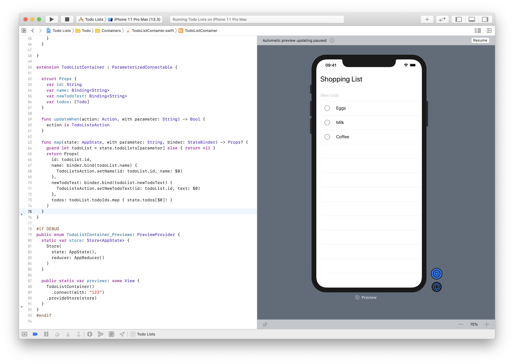

# SwiftDux Todo List App

A simple Todo app written for SwiftUI using the [SwiftDux](https://github.com/StevenLambion/SwiftDux) library. There's partial iPad support, but SwiftUI's split view and navigation functionality is not fully complete. It's using the Swift 5.2 branch of SwiftDux, so it requires Xcode 11.4 or higher.

# Project Patterns

## Redux / Elm Architecture using Ducks
SwiftDux helps build applications using an architecture popularized by elm and redux. There's a "Ducks" directory containing the application state and logic. "Ducks" is a common pattern to organize the application state into feature modules. Each feature has its own directory containing its state, actions, and reducer. A module also defines a protocol suffixed with "Root" to provide the shape it requires in the application state.

## Container vs View
This application uses a popular pattern from the React community know as the container ("smart") vs presentation ("dumb") components. The presentation component is stateless, and represents some kind of UI element. The container, however, is stateful. It tracks the application's state and connects functionality.

In SwiftUI, Views are the "components". There's two directories, "Views" and "Containers", to separate the two types. The containers are used to connect the application state to the views, and dispatches any actions to the store.

# Xcode Previews
Each view and container has a preview to demonstrate how it works with SwiftDux. For containers, a store object should be provided. For a more realistic expectation, the same store used by the running application is a good option.

## Things to do:

- Multi-window support with UIScene.
- Split view navigation button to expand / collapse the master view.
  - This is currently missing.
- Remove arrows from master view on iPad.
  - This is an implementation detail of NavigationLink.
- Autofocus text fields when adding a new item.
  - Not supported yet by TextField
