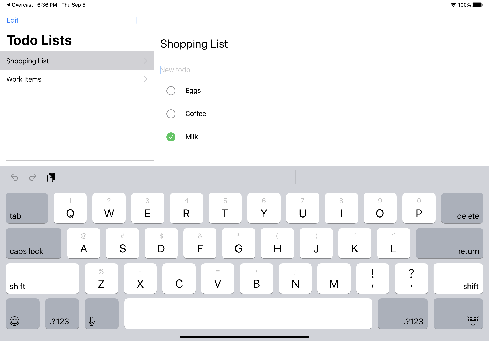

# SwiftDux Todo App

A reference implementation of a todo app to test out SwiftUI using [SwiftDux](https://github.com/StevenLambion/SwiftDux). This example is still a work in progress. There's partial iPad support, but SwiftUI's split view and navigation functionality is still not fully complete. It currently requires iOS 13.1 to work properly.

## Things to do:

Some of the items below are possible now if using a custom built SplitView and deprecated APIs. The point of this project though is to see what's possible in SwiftUI while it develops.

- Multi-window support with UIScene.
- Split view navigation button to expand / collapse the master view.
  - This is currently missing. It was also missing in the SwiftUI Essentials video.
- Remove arrows from master view on iPad.
  - This is an implemenation detail of NavigationLink.
- Autofocus text fields when adding a new item.
